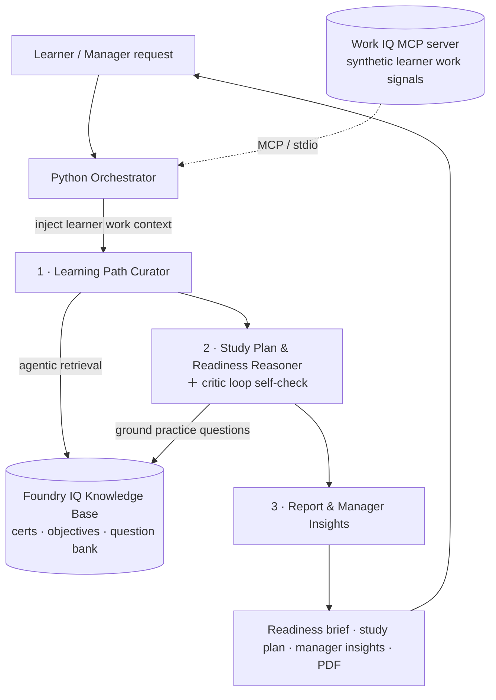
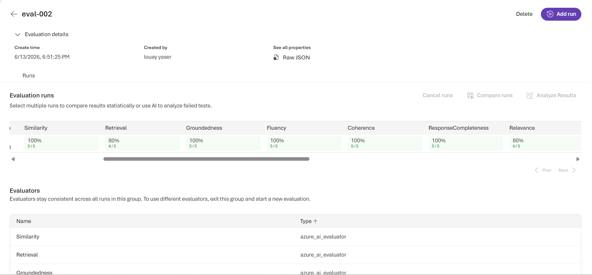

# 🎓 SkillGate IQ

**An AI learning-readiness committee for enterprise certification programs.**
Built for the **Microsoft Agents League — Reasoning Agents track (Challenge A: Enterprise Learning System)**.

SkillGate IQ takes a single request — *"Help L-2001, a DevOps Engineer, prepare for ACP-DO2 in 8 weeks"* — and runs it through three specialised reasoning agents on **Microsoft Foundry** to produce a **cited, capacity-aware study plan**, a **readiness assessment** that self-checks its own work, grounded **practice questions**, and **manager-level insights** — all rendered in a clean web UI and exportable as a one-click PDF.

> **Tech:** Python · Azure AI Foundry (multi-agent + Foundry IQ) · Model Context Protocol (Work IQ) · Flask + SSE · `gpt-4o-mini`

---

## Table of contents
- [The problem](#the-problem)
- [What it does](#what-it-does)
- [Architecture](#architecture)
- [The two Microsoft IQ layers](#the-two-microsoft-iq-layers)
- [Multi-step reasoning (the centerpiece)](#multi-step-reasoning-the-centerpiece)
- [The agents](#the-agents)
- [Knowledge base](#knowledge-base-foundry-iq)
- [Reliability & Safety](#reliability--safety)
- [Evaluation](#evaluation)
- [Project structure](#project-structure)
- [Getting started](#getting-started)
- [Demo walkthrough](#demo-walkthrough)
- [How it maps to the judging criteria](#how-it-maps-to-the-judging-criteria)
- [Submission requirements checklist](#submission-requirements-checklist)
- [Synthetic data statement](#synthetic-data-statement)
- [Limitations & future work](#limitations--future-work)

---

## The problem

Enterprises run internal certification programs, but learners rarely get a study plan that reflects **how much time they actually have**. A generic "study 25 hours" plan ignores a learner buried in 24 meeting-hours a week. Managers, meanwhile, have no early signal on which teams are at risk of missing certification targets.

SkillGate IQ acts as an **AI learning-readiness committee**: it understands certification requirements per role, grounds everything in approved learning content, weighs each learner's real work capacity, builds a realistic plan, checks its own reasoning, and surfaces team-level risk to managers — without ever enrolling, scheduling, or assessing on anyone's behalf.

## What it does

- 📚 Maps a **certification target + role** to required skills and **cited** learning resources
- 🧮 Generates a **capacity-aware study plan** that fits the learner's available focus hours
- 🔁 Runs a **critic loop** that self-checks the plan against capacity, coverage, and grounding
- 📝 Produces **grounded, cited practice questions** from an approved question bank
- 📊 Gives a **readiness assessment** (On track / At risk / Not ready, scored 0–100)
- 🔄 **Adapts over time** — re-running as a learner logs progress moves the verdict (e.g. At risk → On track)
- 👔 Surfaces **manager insights** — team readiness and capacity-risk areas, by ID only
- 📄 Exports the whole brief as a clean **PDF**

---

## Architecture

Three role-specialised agents hosted on Microsoft Foundry, coordinated by a Python orchestrator. Each agent has a distinct job; **no agent takes any action** — the output is decision support for a human.



**Why a Python orchestrator (not a Foundry Workflow):** it gives full control over JSON validation, a scope guardrail, rate-limit retries, and the Work IQ MCP bridge between steps — and degrades gracefully if any optional layer is unavailable.

---

## The two Microsoft IQ layers

SkillGate IQ integrates **two** Microsoft IQ layers (the track requires at least one):

| Layer | Role in SkillGate IQ | How |
|---|---|---|
| **Foundry IQ** | Grounded knowledge — certification requirements, exam objectives, study best-practices, and the practice-question bank | A Foundry IQ knowledge base (file source + restricted web source) with **agentic, cited retrieval**. Used by Agents 1 & 2. Every requirement and question carries a citation (e.g. `LRN-QB-004 §ACP-DO2 / Secure DevOps`). |
| **Work IQ** | Per-learner work context — meeting load, focus hours, preferred learning slot, study history | Implemented as the **Work IQ pattern** over an **MCP server** (synthetic signals). The orchestrator queries it as an MCP client and injects the learner's context so plans fit real capacity. *See the [honest note](#a-note-on-work-iq).* |

This pairing is the heart of the product: **Foundry IQ decides *what* to learn; Work IQ decides *how much* is realistic.**

---

## Multi-step reasoning (the centerpiece)

The pipeline is a **Planner → Critic → Synthesiser** chain, with role-based specialisation:

1. **Curate** — the Learning Path Curator retrieves cited requirements and computes skill gaps, then folds in Work IQ signals to raise `capacity_flags`.
2. **Plan & self-check** — the Reasoner builds the plan and grounded questions, then runs a **critic loop** that verifies:
   - does total study time fit the learner's focus hours over the timeline? (`plan_fits_capacity`)
   - is every skill gap covered by a milestone? (`gaps_all_covered`)
   - is every practice question grounded in a citation? (`questions_all_grounded`)
   - and removes any unsupported claim (`claims_removed`).
3. **Synthesise** — the Report Agent produces the learner brief + manager insights.

### Worked example — `L-2001` (live output)

> **Request:** *"Help L-2001, a DevOps Engineer, prepare for ACP-DO2 in the next 8 weeks."*

Maya (L-2001) has **24 meeting hrs/wk, only 9 focus hrs/wk**, a 62% practice average, and a critical gap in Secure DevOps. SkillGate IQ reasoned:

- **Readiness: At risk (55/100)** — not "Not ready" (she has time), not "On track" (gaps + below-target score).
- **Plan: 8 weeks @ ~3 h/wk** — 25 recommended hours spread across 8 weeks *does* fit her 9 focus hrs/wk, so `plan_fits_capacity: true` — a genuinely correct, non-obvious judgement.
- **Manager insight:** flagged *"Capacity constraints with 24 meeting hours…"* as a risk area, grounded in both Work IQ and `LRN-WL-006`.
- **Critic loop:** `self_check_passed: true`.

The same engine returns **On track** for a high-capacity learner (L-2005) and **Not ready** for an under-prepared expert-cert candidate (L-2004). And it **adapts**: re-run the same learner after they've logged more study hours and freed up focus time, and the verdict moves from **At risk → On track** — the system reasons over their latest reality, matching Challenge A's "loop back and adapt" flow.

---

## The agents

| # | Agent | Tools | Key output |
|---|---|---|---|
| 1 | **Learning Path Curator** | Foundry IQ + Work IQ | `required_skills`, `recommended_resources` (cited), `skill_gaps`, `capacity_flags`, `learner_context` |
| 2 | **Study Plan & Readiness Reasoner** | Foundry IQ | `study_plan` (milestones), `practice_questions` (cited), `readiness_status/score`, `critic_loop_summary` |
| 3 | **Report & Manager Insights** | — (pure synthesis) | final `report`: executive summary, plan, gaps, questions, `manager_insights`, `assistant_notice` |

All three return strict JSON validated by the orchestrator. Full system prompts and JSON schemas are configured in Foundry; the agent wrappers live in [`agents/`](agents/).

---

## Knowledge base (Foundry IQ)

Six synthetic documents power grounded retrieval. All are original, fabricated content for a fictional **Acme Corp** certification program — no real exam material, no PII.

| File | Doc ID | Contents |
|---|---|---|
| `certification_catalog.md` | LRN-CAT-001 | certs, skills, recommended hours, prerequisites, target scores |
| `role_certification_map.md` | LRN-MAP-002 | role → primary/secondary cert + study cadence |
| `exam_objectives.md` | LRN-OBJ-003 | per-skill objectives + difficulty |
| `practice_question_bank.md` | LRN-QB-004 | approved practice questions (grounds Agent 2) |
| `study_best_practices.md` | LRN-BP-005 | readiness criteria, sequencing, study patterns |
| `workload_learning_correlation.md` | LRN-WL-006 | capacity rules + manager risk thresholds |

Find them in [`knowledge_base/`](knowledge_base/).

---

## Reliability & Safety

SkillGate IQ is **read-only decision support**. It cannot enrol, schedule, or assess — every brief ends with an explicit human-oversight notice.

- **Input/scope guardrail** — the Curator returns `in_scope: false` for off-topic requests; the orchestrator also has a heuristic backstop. Out-of-scope queries get a calm refusal, not a fabricated plan.
- **Human oversight & transparency** — every report carries: *"This is AI-generated learning guidance, not a guarantee of exam outcome…"* and never exposes individual personal data (learners by ID only).
- **Rate-limit resilience** — all Foundry calls use exponential-backoff retry on HTTP 429 / timeouts.
- **Fail-safe Work IQ** — if the Work IQ layer is unavailable, the pipeline continues on the knowledge base alone; Work IQ can never break a run.
- **Robust parsing** — agent output is parsed defensively (handles code fences and duplicate JSON objects).
- **Synthetic data only** — see the [statement below](#synthetic-data-statement).

---

## Evaluation

SkillGate IQ's readiness outputs were evaluated in the **Microsoft Foundry portal** using its built-in evaluators, graded by `gpt-4o-mini`, against a dataset of learner scenarios spanning all three readiness states plus an out-of-scope guardrail case ([`evals/eval_dataset.jsonl`](evals/eval_dataset.jsonl)).

| Evaluator | Result | What it measures |
|---|---|---|
| **Groundedness** | **100%** (5/5) | Every verdict is supported by the retrieved knowledge-base context — no hallucinated requirements |
| **Similarity** | **100%** (5/5) | Verdicts match the expected reference outcome |
| **Coherence** | **100%** (5/5) | Logically consistent, well-structured output |
| **Fluency** | **100%** (5/5) | Clear, well-formed language |
| **ResponseCompleteness** | **100%** (5/5) | Covers everything the request needs |
| **Relevance** | **80%** (4/5) | Responses directly address the learner's request |
| **Retrieval** | **80%** (4/5) | Quality of the grounding context used |
| **Safety suite** (violence, hate/unfairness, self-harm, indirect-attack/prompt-injection, ungrounded attributes) | **0% defect** | No harmful content detected across any row |

> _Evaluation run in Azure AI Foundry → Evaluation; dataset in [`evals/`](evals/). Screenshot below._
>
> _(GroundednessPro was excluded — its backend service is not enabled in the project's region; the standard Groundedness evaluator is used instead.)_



These results map directly to the judging rubric: **Groundedness/Relevance → Accuracy & Relevance (25%)**, and the **0% safety defect rate → Reliability & Safety (20%)**.

---

## Project structure

```
skillgate-iq/
├── app.py                     # Flask app — SSE streaming, scope guard, history
├── main.py                    # CLI orchestrator (run the pipeline in a terminal)
├── requirements.txt
├── agents/
│   ├── _shared.py             # robust JSON parsing + 429 retry/backoff
│   ├── learning_path_curator.py
│   ├── study_plan_reasoner.py
│   └── learning_report_agent.py
├── workiq/                    # Work IQ context layer (MCP)
│   ├── data.py                # synthetic learners + teams
│   ├── server.py              # FastMCP server (learner/team tools)
│   └── client.py              # MCP client used by the orchestrator
├── knowledge_base/            # 6 synthetic docs for Foundry IQ
└── templates/
    └── index.html             # web UI: pipeline view, study-plan timeline, PDF export
```

---

## Getting started

### Prerequisites
- Python 3.10+
- An Azure subscription with a **Microsoft Foundry** project
- `az login` (auth uses `DefaultAzureCredential` — **no API keys in code**)
- The three agents and the knowledge base created in Foundry (prompts + schemas provided in the project docs)

### Install
```bash
python -m venv venv
venv\Scripts\activate          # Windows  (source venv/bin/activate on macOS/Linux)
pip install -r requirements.txt
```

### Configure
Set your Foundry endpoint and agent deployment names in `.env`:
```env
AZURE_PROJECT_ENDPOINT=https://<your-project>.services.ai.azure.com/api/projects/<project>
AZURE_MODEL_DEPLOYMENT=gpt-4o-mini
CURATOR_AGENT_NAME=learning-path-curator
CURATOR_AGENT_VERSION=1
REASONER_AGENT_NAME=study-plan-reasoner
REASONER_AGENT_VERSION=1
REPORT_AGENT_NAME=learning-report-agent
REPORT_AGENT_VERSION=1
```

### Run
```bash
python app.py          # web app at http://localhost:5000
python main.py         # or run the pipeline from the CLI
```
> Set each `*_AGENT_NAME` / `*_AGENT_VERSION` to match **your** Foundry agent deployment names and versions.
> `.env` and `chat_history.json` are git-ignored; never commit credentials.

---

## Demo walkthrough

1. Open `http://localhost:5000`.
2. Click an example, e.g. **"Help L-2001, a DevOps Engineer, prepare for ACP-DO2 in 8 weeks."**
3. Watch the three agents update live (Curator → Reasoner → Report).
4. Review the **readiness banner**, the **week-by-week study plan**, **cited practice questions**, and **manager insights**.
5. Expand **"Work context (Work IQ)"** to see the signals that shaped the plan.
6. Click **⬇ Download PDF** for the full readiness brief.
7. Try an off-topic question to see the **scope guardrail** in action.

🎥 **Demo video:** [Watch the 5-minute demo on YouTube](https://youtu.be/UcNQu-fiv0I)

---

## How it maps to the judging criteria

| Criterion | Weight | Evidence in this repo |
|---|---|---|
| **Accuracy & Relevance** | 25% | Every requirement, resource, and practice question is retrieved from Foundry IQ with a citation; readiness reflects both hours and practice score per `LRN-BP-005`. |
| **Reasoning & Multi-step** | 25% | Planner→Critic→Synthesiser chain; the Reasoner's **critic loop** self-checks capacity fit, gap coverage, and grounding before finalising. |
| **Creativity & Originality** | 15% | The "AI learning-readiness committee" framing + the **Foundry IQ (what to learn) × Work IQ (how much is realistic)** pairing. |
| **UX & Presentation** | 15% | Clean, calm enterprise UI with live agent status, a study-plan timeline, manager insights, and one-click PDF. |
| **Reliability & Safety** | 20% | Scope guardrail, human-oversight notice, ID-only reporting, 429 retry, fail-safe Work IQ, robust parsing, synthetic data. |

## Submission requirements checklist

- ✅ Multi-agent system aligned to **Challenge A (Enterprise Learning System)**
- ✅ Uses **Microsoft Foundry** (hosted agents + Foundry IQ) via the SDK
- ✅ Demonstrates **multi-step reasoning** (critic loop, capacity-aware planning)
- ✅ Integrates an **external tool via MCP** (Work IQ MCP server)
- ✅ Integrates **Microsoft IQ layers** (Foundry IQ **and** Work IQ)
- ✅ **Synthetic data only**
- ✅ **Demoable** with clear agent interactions
- ✅ **Documentation** of agent roles, orchestration, tools, and data sources

---

## Synthetic data statement

All data in this project is **synthetic and for demonstration only**. The certification program, courses, questions, learners, teams, and metrics are fabricated for a fictional *Acme Corp*. There is no real exam material, no customer data, and no PII; learners are referenced only by fabricated IDs (e.g. `L-2001`).

### A note on Work IQ

The Work IQ layer is a faithful implementation of the **Work IQ *pattern*** — work-context signals (meeting load, focus time, learning preferences) informing agent decisions — using **synthetic data served over MCP**. It is **not** a live Microsoft 365 Copilot tenant connection. This follows the starter kit's guidance to "use the Work IQ concept as the context layer," and keeps the demo safe and reproducible. Foundry IQ is a live, configured knowledge base.

---

## Limitations & future work

- **Work IQ** is synthetic; a production version would connect to a real M365 tenant (Copilot license + admin consent) via the Work IQ connector.
- **Single-learner** is the primary flow; team-level requests are summarised in manager insights but could become a first-class flow with a Fabric IQ semantic layer over learner metrics.
- No persistence beyond local `chat_history.json`; a hosted deployment (Foundry Agent Service) would add managed state and a dedicated endpoint.

---

*Built for the Microsoft Agents League / AI Skills Fest — Reasoning Agents track. Decision support only; a human reviews every plan.*
